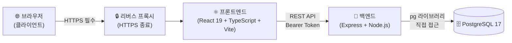
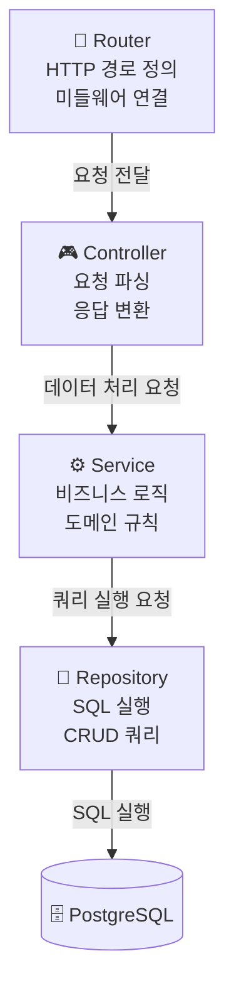
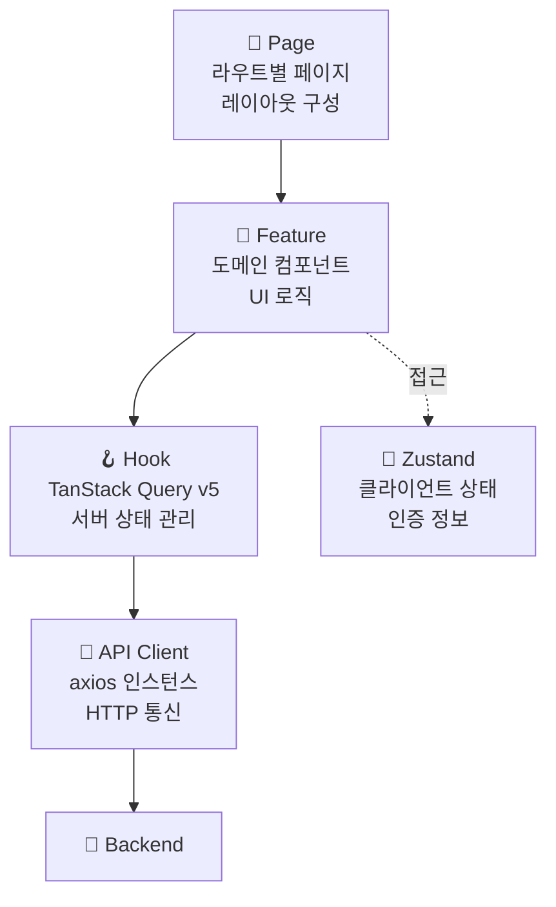
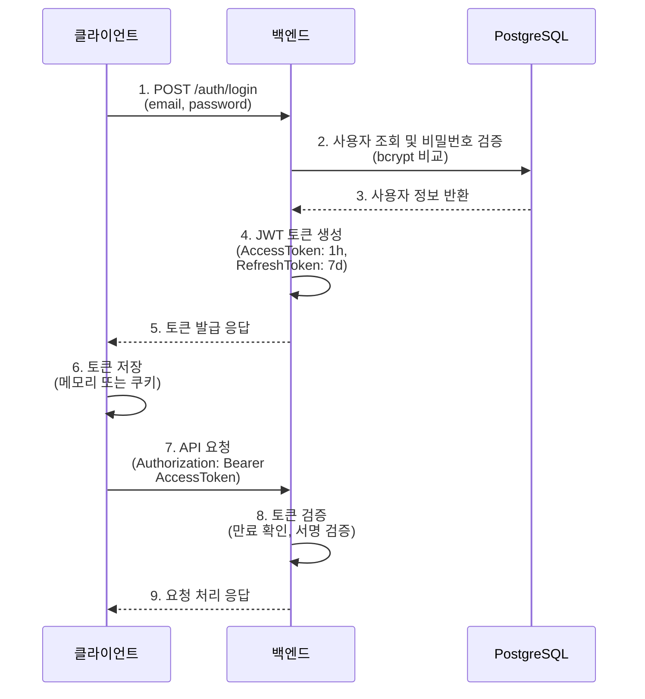

# 기술 아키텍처 다이어그램 - Todolist-App

| 항목      | 내용                                                                                         |
| --------- | -------------------------------------------------------------------------------------------- |
| 문서 버전 | v1.0                                                                                         |
| 작성일    | 2026-05-13                                                                                   |
| 참조 문서 | docs/2-prd.md (v1.3), docs/4-project-structure.md (v1.0), docs/1-domain-definition.md (v1.3) |

---

## 1. 전체 시스템 구조

**설명**: 사용자 브라우저에서 HTTPS를 통해 리버스 프록시로 접근하며, 프론트엔드(React)는 백엔드 REST API를 호출하고, 백엔드(Express)는 pg 라이브러리를 사용하여 PostgreSQL에 직접 접근한다.

---

## 2. 백엔드 레이어 구조

**설명**: 요청은 위에서 아래로 단방향 흐름을 유지한다. 라우터는 경로 정의, 컨트롤러는 HTTP 요청/응답 처리, 서비스는 도메인 규칙(상태 전이, 권한 검증 등) 구현, 레포지토리는 DB 쿼리 전담한다.

---

## 3. 프론트엔드 레이어 구조

**설명**: 페이지는 라우트 단위 컴포넌트이고, 피처는 도메인별 UI 모음이며, 훅은 TanStack Query로 서버 상태(할일 목록, 팀 정보)를 관리하고, Zustand는 클라이언트 상태(인증 토큰)를 관리한다. API 클라이언트는 axios로 백엔드와 통신한다.

---

## 4. 데이터베이스 핵심 엔티티 관계

```mermaid
erDiagram
    USER ||--o{ TODO : creates
    USER ||--o{ TEAM_MEMBER : joins
    TEAM ||--o{ TODO : owns
    TEAM ||--o{ TEAM_MEMBER : has
    TEAM ||--o{ TEAM_INVITATION : sends
    USER ||--o{ TEAM_INVITATION : receives
    USER ||--o{ NOTIFICATION : gets
    CATEGORY ||--o{ TODO : tags

    USER {
        uuid user_id PK
        string email
        string name
    }

    TODO {
        uuid todo_id PK
        uuid user_id FK "nullable"
        uuid team_id FK "nullable"
        uuid category_id FK "nullable"
        string title
        string status
        date due_date
    }

    TEAM {
        uuid team_id PK
        string name
        uuid created_by FK
    }

    TEAM_MEMBER {
        uuid team_member_id PK
        uuid team_id FK
        uuid user_id FK
        string role
    }

    TEAM_INVITATION {
        uuid invitation_id PK
        uuid team_id FK
        uuid invited_user_id FK
        string status
    }

    CATEGORY {
        uuid category_id PK
        uuid owner_id FK
        string owner_type
        string name
    }

    NOTIFICATION {
        uuid notification_id PK
        uuid user_id FK
        string type
        boolean is_read
    }
```

**설명**: 핵심 엔티티는 User, Todo, Team, Category, TeamMember, TeamInvitation, Notification이다. Todo는 개인 할일(user_id 필수, team_id NULL)과 팀 할일(team_id 필수, user_id는 생성자)로 구분되며, Category는 User 또는 Team에 귀속된다(owner_type). 모든 관계는 카디널리티만 표시하여 단순하게 유지했다.

---

## 5. JWT 인증 흐름

**설명**: 로그인 시 이메일/비밀번호로 bcrypt 검증 후 액세스 토큰(1시간) 및 리프레시 토큰(7일)을 발급한다. 이후 모든 API 요청은 Authorization 헤더에 Bearer 토큰을 담아 전송하고, 백엔드는 토큰을 검증한 후 요청을 처리한다.

---

## 변경 이력

| 버전 | 날짜       | 변경자           | 변경 내용                                                                            |
| ---- | ---------- | ---------------- | ------------------------------------------------------------------------------------ |
| v1.0 | 2026-05-13 | Technical Writer | 초안 작성 (5개 Mermaid 다이어그램 포함)                                              |
| v1.1 | 2026-05-13 | Reviewer         | 기술 스택 일관성 검토 반영: 프론트엔드 노드에 Vite 추가, TanStack Query v5 버전 명시 |

---

_본 문서는 Todolist-App의 기술 아키텍처를 시각화하여 시스템 구성, 계층 설계, 데이터 모델, 인증 흐름을 한눈에 파악할 수 있도록 한다._
