# ERD (Entity-Relationship Diagram) - Todolist-App

| 항목      | 내용                                                                 |
| --------- | -------------------------------------------------------------------- |
| 문서 버전 | v1.0                                                                 |
| 작성일    | 2026-05-13                                                           |
| 참조 문서 | docs/2-prd.md (v1.4), docs/5-arch-diagram.md (v1.0), docs/1-domain-definition.md (v1.3) |
| 상태      | 초안                                                                 |

---

## 1. ERD 다이어그램

> **참고**: `categories.owner_id`는 `users.user_id` 또는 `teams.team_id`를 가리키는 **polymorphic FK**이다.
> Mermaid erDiagram은 polymorphic 관계를 표준 FK 선으로 표현할 수 없으므로 관계선을 생략하고 필드 주석으로 처리한다.
> `audit_logs.actor_user_id`는 사용자 하드 삭제 후 NULL이 될 수 있어 optional 관계로 표현한다.

```mermaid
erDiagram

    users {
        uuid        user_id         PK  "사용자 고유 식별자"
        string      email               "로그인 이메일 (UNIQUE, NOT NULL)"
        string      name                "사용자 이름 (NOT NULL)"
        string      password_hash       "bcrypt 해시 비밀번호 (NOT NULL)"
        timestamptz created_at          "가입 일시 (NOT NULL)"
        timestamptz updated_at          "정보 수정 일시 (NOT NULL)"
    }

    todos {
        uuid        todo_id         PK  "할일 고유 식별자"
        uuid        user_id         FK  "개인 소유자 또는 팀 할일 생성자 (nullable — 팀 탈퇴·삭제 시 NULL)"
        uuid        team_id         FK  "소속 팀 (nullable — 개인 할일은 NULL)"
        uuid        category_id     FK  "카테고리 (nullable — 카테고리 삭제 시 NULL)"
        string      title               "할일 제목 (NOT NULL)"
        text        description         "할일 설명 (nullable)"
        string      status              "진행 상태: PLANNED | IN_PROGRESS | DONE | ON_HOLD (NOT NULL)"
        date        start_date          "시작일 (nullable)"
        date        due_date            "종료일/마감일 (nullable, due_date >= start_date)"
        timestamptz created_at          "생성 일시 (NOT NULL)"
        timestamptz updated_at          "수정 일시 (NOT NULL)"
    }

    categories {
        uuid        category_id     PK  "카테고리 고유 식별자"
        uuid        owner_id            "소유자 ID — polymorphic: users.user_id 또는 teams.team_id (NOT NULL)"
        string      owner_type          "소유 주체 유형: USER | TEAM (NOT NULL)"
        string      name                "카테고리명 (NOT NULL, owner 범위 내 UNIQUE)"
        string      color               "색상 태그 HEX 코드 #RRGGBB (nullable)"
        timestamptz created_at          "생성 일시 (NOT NULL)"
    }

    teams {
        uuid        team_id         PK  "팀 고유 식별자"
        string      name                "팀 이름 (NOT NULL)"
        text        description         "팀 설명 (nullable)"
        uuid        created_by      FK  "팀 생성자 (users.user_id, NOT NULL)"
        timestamptz created_at          "가입 일시 (NOT NULL)"
        timestamptz updated_at          "정보 수정 일시 (NOT NULL)"
    }

    team_members {
        uuid        team_member_id  PK  "멤버십 고유 식별자"
        uuid        team_id         FK  "소속 팀 (NOT NULL)"
        uuid        user_id         FK  "소속 사용자 (NOT NULL)"
        string      role                "팀 역할: ADMIN | MEMBER | VIEWER (NOT NULL)"
        timestamptz joined_at           "팀 참여 일시 (NOT NULL)"
    }

    team_invitations {
        uuid        invitation_id   PK  "초대 고유 식별자"
        uuid        team_id         FK  "초대 대상 팀 (NOT NULL)"
        uuid        invited_user_id FK  "초대받은 사용자 (NOT NULL)"
        uuid        invited_by      FK  "초대한 사용자 users.user_id (NOT NULL)"
        string      role                "수락 시 부여 역할: MEMBER | VIEWER (NOT NULL)"
        string      status              "초대 상태: PENDING | ACCEPTED | DECLINED | EXPIRED (NOT NULL)"
        timestamptz expires_at          "초대 만료 일시 (NOT NULL)"
        timestamptz created_at          "초대 생성 일시 (NOT NULL)"
        timestamptz responded_at        "수락 또는 거절 일시 (nullable)"
    }

    notifications {
        uuid        notification_id PK  "알림 고유 식별자"
        uuid        user_id         FK  "수신 사용자 (NOT NULL)"
        string      type                "알림 유형: DUE_DATE_REMINDER | TEAM_INVITE | TODO_ASSIGNED (NOT NULL)"
        string      message             "알림 내용 (NOT NULL)"
        uuid        reference_id        "관련 엔티티 ID — 예: invitation_id (nullable)"
        boolean     is_read             "읽음 여부 (NOT NULL, default false)"
        timestamptz created_at          "생성 일시 (NOT NULL)"
    }

    audit_logs {
        uuid        audit_log_id    PK  "감사 로그 고유 식별자"
        string      entity_type         "대상 엔티티: User | Todo | Category | Team | TeamMember | TeamInvitation (NOT NULL)"
        uuid        entity_id           "대상 엔티티 식별자 (NOT NULL)"
        string      change_type         "변경 유형: CREATE | UPDATE | DELETE (NOT NULL)"
        uuid        actor_user_id   FK  "변경 수행 사용자 (nullable — 하드 삭제 후 참조 불가 시 NULL)"
        jsonb       before_value        "변경 전 값 (nullable)"
        jsonb       after_value         "변경 후 값 (nullable)"
        jsonb       metadata            "추가 메타데이터 (nullable)"
        timestamptz created_at          "변경 발생 일시 (NOT NULL)"
    }

    refresh_tokens {
        uuid        token_id        PK  "토큰 고유 식별자"
        uuid        user_id         FK  "소유 사용자 (NOT NULL)"
        string      token_hash          "토큰 해시값 (NOT NULL)"
        timestamptz expires_at          "만료 일시 (NOT NULL)"
        timestamptz created_at          "생성 일시 (NOT NULL)"
        timestamptz revoked_at          "무효화 일시 (nullable — 로그아웃·탈퇴 시 설정)"
    }

    %% ── 관계 정의 ──────────────────────────────────────────────────

    %% users → todos : 개인 할일 소유 또는 팀 할일 생성자 (nullable FK)
    users       ||--o{     todos               : "owns / creates"

    %% teams → todos : 팀 할일 소유 (nullable FK)
    teams       ||--o{     todos               : "owns"

    %% categories → todos : 카테고리 분류 (nullable FK, 카테고리 삭제 시 NULL)
    categories  |o--o{     todos               : "tags"

    %% users → teams : 팀 생성자
    users       ||--o{     teams               : "creates"

    %% teams → team_members : 팀 멤버십
    teams       ||--o{     team_members        : "has"

    %% users → team_members : 사용자 팀 소속
    users       ||--o{     team_members        : "joins"

    %% teams → team_invitations : 팀 초대 발송
    teams       ||--o{     team_invitations    : "sends"

    %% users → team_invitations (invited_user_id) : 초대 수신
    users       ||--o{     team_invitations    : "receives"

    %% users → team_invitations (invited_by) : 초대 생성
    users       ||--o{     team_invitations    : "invites via"

    %% users → notifications : 알림 수신
    users       ||--o{     notifications       : "gets"

    %% users → audit_logs (actor_user_id) : 변경 수행자 (nullable)
    users       |o--o{     audit_logs          : "acts on"

    %% users → refresh_tokens : 리프레시 토큰 소유
    users       ||--o{     refresh_tokens      : "holds"
```

---

## 2. 엔티티 상세 설명

### 2.1 users

**역할**: 회원가입을 통해 계정을 생성한 인증 주체. 이메일과 비밀번호로 인증하며 개인 할일·카테고리의 소유자이자 팀 소속의 기반이 된다.

**주요 제약사항**

| 컬럼 | 제약 |
|------|------|
| email | UNIQUE, NOT NULL — 중복 이메일 가입 불가 (USR-001) |
| password_hash | NOT NULL — bcrypt 해시 저장, 평문 금지 (USR-002) |
| user_id | PK, UUID |

**비즈니스 규칙**

- USR-001: 이메일은 시스템 전체에서 유일해야 한다.
- USR-002 / USR-002-1: 비밀번호는 bcrypt로 해시하여 저장하며, 최소 8자·영문자·숫자·특수문자 각 1자 이상 포함해야 한다.
- USR-003: 회원 탈퇴 시 즉시 하드 삭제된다. 소프트 삭제 없음.
- USR-005: 비밀번호 재설정 링크는 발송 후 30분 이내에만 유효하다.
- AUTH-006: 액세스 토큰 유효 기간 1시간, 리프레시 토큰 유효 기간 7일.

**컬럼 설명**

- `password_hash`: 감사 로그에 포함하지 않는 민감 정보 (AUD-003).
- `updated_at`: 프로필 수정 이벤트마다 갱신된다.

---

### 2.2 todos

**역할**: 사용자가 수행해야 할 작업 단위. 개인 할일(`team_id = NULL`)과 팀 할일(`team_id NOT NULL`)로 구분된다.

**주요 제약사항**

| 컬럼 | 제약 |
|------|------|
| title | NOT NULL (TODO-001) |
| status | NOT NULL, PLANNED \| IN_PROGRESS \| DONE \| ON_HOLD (TODO-003) |
| user_id | nullable FK → users — 팀 탈퇴·삭제 시 NULL 가능 (TODO-010, TEAM-004) |
| team_id | nullable FK → teams — 개인 할일은 NULL (TODO-010) |
| category_id | nullable FK → categories — 카테고리 삭제 시 NULL (CAT-002) |

**비즈니스 규칙**

- TODO-001: 제목은 필수 입력 항목이다.
- TODO-002: `due_date >= start_date` 조건을 항상 만족해야 한다.
- TODO-003: `status` 값은 허용된 Enum 값 중 하나여야 한다.
- TODO-004: 삭제된 할일은 복구 불가(하드 삭제).
- TODO-008: 진행 상태 전이는 허용된 경우만 가능하다. DONE → IN_PROGRESS 전이는 재개 상황에서 허용된다.
- TODO-009: 날짜 조회(오늘·이번 주)는 KST(UTC+9) 기준으로 처리한다.
- TODO-010: 개인 할일은 `user_id` 필수, `team_id = NULL`. 팀 할일은 `team_id` 필수, `user_id`는 생성자 참조(nullable).
- TEAM-005: 팀 삭제 시 해당 팀의 모든 할일도 함께 삭제된다.

**컬럼 설명**

- `status`: 허용 상태 전이 매트릭스(TODO-008) 기반으로 서비스 레이어에서 검증한다.
- `start_date` / `due_date`: 날짜(DATE 타입), 시간대 없음. 시간대 해석은 KST 기준.

---

### 2.3 categories

**역할**: 할일을 분류하기 위한 그룹. 사용자(USER) 또는 팀(TEAM) 중 하나를 소유 주체로 가진다.

**주요 제약사항**

| 컬럼 | 제약 |
|------|------|
| owner_id | NOT NULL — polymorphic: `users.user_id` 또는 `teams.team_id` |
| owner_type | NOT NULL, USER \| TEAM |
| name | NOT NULL, (owner_id, owner_type) 범위 내 UNIQUE (CAT-001) |
| color | nullable, HEX 형식 #RRGGBB (CAT-004) |

**비즈니스 규칙**

- CAT-001: 카테고리명은 동일 소유자 범위 내 중복 불가.
- CAT-002: 카테고리 삭제 시 해당 카테고리에 속한 할일의 `category_id`는 NULL 처리 (ON DELETE SET NULL).
- CAT-003: 신규 사용자 가입 시 기본 카테고리 6종(업무, 개인, 학습, 회의, 프로젝트, 긴급 업무) 자동 생성.
- CAT-004: 색상은 HEX 코드(#RRGGBB) 형식으로 저장.

**컬럼 설명**

- `owner_id`: DB FK 제약 없이 애플리케이션 레이어에서 `owner_type` 값에 따라 `users` 또는 `teams` 테이블을 참조하는 polymorphic 설계.
- `owner_type`: 팀 카테고리는 팀 ADMIN만 생성·수정·삭제 가능.

---

### 2.4 teams

**역할**: 할일 공유 및 협업 그룹. 생성자는 자동으로 ADMIN 역할을 부여받는다.

**주요 제약사항**

| 컬럼 | 제약 |
|------|------|
| name | NOT NULL |
| description | nullable |
| created_by | NOT NULL, FK → users.user_id |

**비즈니스 규칙**

- TEAM-001: 팀 생성자는 자동으로 ADMIN 역할 부여 (team_members에 레코드 생성).
- TEAM-002: 팀에 최소 1명의 ADMIN 상시 유지. 마지막 ADMIN은 역할 변경·탈퇴 불가.
- TEAM-005: 팀 삭제 시 팀의 모든 할일·카테고리 함께 삭제.

**컬럼 설명**

- `description`: 팀의 목적 또는 상세 설명 (nullable).
- `created_by`: 초기 ADMIN 식별을 위한 참조. 사용자 하드 삭제 시 참조 무결성에 주의 필요(ON DELETE 정책 별도 결정 필요).

---

### 2.5 team_members

**역할**: 사용자와 팀 간의 N:M 관계를 해소하는 연결 테이블. 각 멤버십에 팀 역할을 부여한다.

**주요 제약사항**

| 컬럼 | 제약 |
|------|------|
| team_id | NOT NULL, FK → teams |
| user_id | NOT NULL, FK → users |
| role | NOT NULL, ADMIN \| MEMBER \| VIEWER |
| (team_id, user_id) | UNIQUE — 동일 팀 중복 가입 불가 (TEAM-003) |

**비즈니스 규칙**

- TEAM-002: ADMIN이 한 명만 남은 경우 해당 ADMIN의 역할 변경·탈퇴 불가.
- TEAM-003: 한 사용자는 동일 팀에 중복 가입 불가 (`UNIQUE(team_id, user_id)`).
- TEAM-004: 팀 탈퇴 시 해당 사용자가 생성한 팀 할일의 `user_id`는 NULL 처리.
- AUTH-003: ADMIN·MEMBER만 팀 할일 생성·수정·삭제 가능.
- AUTH-004: VIEWER는 팀 할일 조회만 가능.
- AUTH-005: 멤버 초대·역할 변경·추방은 ADMIN만 수행 가능.

**컬럼 설명**

- `role`: 권한 검증의 핵심 컬럼. 역할별 허용 기능은 PRD 섹션 3.4 역할별 권한 표 참조.
- `joined_at`: 초대 수락 시점이 기록된다 (INV-003).

---

### 2.6 team_invitations

**역할**: 팀 ADMIN이 사용자를 팀에 합류시키기 위해 생성하는 초대 요청. 수락·거절·만료 상태를 관리한다.

**주요 제약사항**

| 컬럼 | 제약 |
|------|------|
| team_id | NOT NULL, FK → teams |
| invited_user_id | NOT NULL, FK → users |
| invited_by | NOT NULL, FK → users.user_id |
| role | NOT NULL, MEMBER \| VIEWER |
| status | NOT NULL, PENDING \| ACCEPTED \| DECLINED \| EXPIRED |
| expires_at | NOT NULL |

**비즈니스 규칙**

- INV-001: 초대는 ADMIN만 생성할 수 있다.
- INV-002: 이미 팀 소속이거나 PENDING 초대가 있는 사용자는 재초대 불가.
- INV-003: 수락 시 `status = ACCEPTED`, team_members 레코드 생성.
- INV-004: 거절 시 `status = DECLINED`, team_members 생성 안 함.
- INV-005: 만료된 초대(`expires_at < now`)는 수락 불가, `status = EXPIRED` 처리.
- NOTIF-002: 초대 생성 시 피초대자에게 `TEAM_INVITE` 알림 발송.

**컬럼 설명**

- `status`: 상태 전이는 PENDING → ACCEPTED | DECLINED | EXPIRED 단방향.
- `responded_at`: 수락 또는 거절 처리 시점. EXPIRED 처리 시에는 NULL 유지 가능.
- `invited_by`: 초대 생성자 추적 및 감사 로그 연계에 활용.

---

### 2.7 notifications

**역할**: 시스템이 사용자에게 발송하는 인앱 이벤트 메시지. 마감일 알림, 팀 초대, 할일 배정 유형을 지원한다.

**주요 제약사항**

| 컬럼 | 제약 |
|------|------|
| user_id | NOT NULL, FK → users |
| type | NOT NULL, DUE_DATE_REMINDER \| TEAM_INVITE \| TODO_ASSIGNED |
| message | NOT NULL |
| is_read | NOT NULL, default false |

**비즈니스 규칙**

- NOTIF-001: 할일 마감일 1일 전 자동 `DUE_DATE_REMINDER` 발송.
- NOTIF-002: 팀 초대 생성 시 피초대자에게 `TEAM_INVITE` 발송. `reference_id = invitation_id`.
- NOTIF-003: 읽지 않은 알림은 `is_read = false`, 사용자 확인 시 `true` 변경.

**컬럼 설명**

- `message`: 알림 본문 내용 (NOT NULL).
- `reference_id`: polymorphic 참조 필드. `type = TEAM_INVITE`이면 `team_invitations.invitation_id`, `type = DUE_DATE_REMINDER`이면 `todos.todo_id` 등 유형에 따라 참조 대상이 달라진다. DB FK 제약 없이 애플리케이션에서 관리.
- 알림 목록은 `created_at` 내림차순(최신순) 정렬이 기본이다.

---

### 2.8 audit_logs

**역할**: User, Todo, Category, Team, TeamMember, TeamInvitation의 생성·수정·삭제 이벤트에 대한 변경 이력을 저장한다.

**주요 제약사항**

| 컬럼 | 제약 |
|------|------|
| entity_type | NOT NULL |
| entity_id | NOT NULL |
| change_type | NOT NULL, CREATE \| UPDATE \| DELETE |
| actor_user_id | nullable FK → users — 사용자 하드 삭제 후 NULL 허용 |

**비즈니스 규칙**

- AUD-001: 6개 엔티티(User, Todo, Category, Team, TeamMember, TeamInvitation)의 CUD 이벤트를 기록한다.
- AUD-002: 대상 엔티티, 엔티티 ID, 변경 유형, 수행자, 변경 일시, 변경 전·후 값을 저장한다.
- AUD-003: 비밀번호 해시, 인증 토큰 등 민감 정보는 저장하지 않는다. User 삭제 이벤트는 이메일·이름 마스킹 또는 제외.
- AUD-004: `actor_user_id`는 nullable — 사용자 하드 삭제 이후에도 감사 로그 레코드가 보존되어야 한다.

**컬럼 설명**

- `before_value` / `after_value`: JSONB 타입. CREATE 시 `before_value = NULL`, DELETE 시 `after_value = NULL`.
- `metadata`: IP 주소, User-Agent 등 추가 컨텍스트 정보를 자유 형식으로 저장.
- 감사 로그 레코드는 삭제하지 않는 것을 원칙으로 한다 (불변 이력).

---

### 2.9 refresh_tokens

**역할**: 리프레시 토큰을 DB에 저장하여 로그아웃·탈퇴 시 즉시 무효화할 수 있도록 한다.

**주요 제약사항**

| 컬럼 | 제약 |
|------|------|
| user_id | NOT NULL, FK → users |
| token_hash | NOT NULL |
| expires_at | NOT NULL |

**비즈니스 규칙**

- AUTH-006: 리프레시 토큰 유효 기간은 7일.
- 로그아웃 또는 회원 탈퇴 시 `revoked_at`을 현재 시각으로 설정하여 즉시 무효화한다.
- 만료(`expires_at < now`) 또는 폐기(`revoked_at IS NOT NULL`) 토큰은 갱신 요청에 사용 불가.

**컬럼 설명**

- `token_hash`: 실제 토큰 문자열 대신 해시값만 저장하여 DB 탈취 시 토큰 노출을 방지.
- `revoked_at`: NULL이면 유효, NOT NULL이면 폐기 상태. 로그아웃·탈퇴 플로우에서 설정.

---

## 3. 관계 정의

| 관계 | 카디널리티 | 설명 |
|------|-----------|------|
| users → todos (user_id) | 1 : 0..N | 한 사용자는 여러 개인 할일을 소유하거나 팀 할일 생성자로 참조된다. 팀 탈퇴·삭제 시 NULL (TODO-010, TEAM-004) |
| teams → todos (team_id) | 1 : 0..N | 한 팀은 여러 팀 할일을 가진다. 팀 삭제 시 할일도 함께 삭제 (TEAM-005) |
| categories → todos (category_id) | 0..1 : 0..N | 카테고리는 여러 할일을 분류한다. 카테고리 삭제 시 category_id = NULL (CAT-002) |
| users → teams (created_by) | 1 : 0..N | 한 사용자는 여러 팀을 생성할 수 있다. 팀 생성자는 자동 ADMIN (TEAM-001) |
| teams → team_members | 1 : 1..N | 한 팀은 1명 이상의 멤버를 가진다. 최소 1명의 ADMIN 필수 (TEAM-002) |
| users → team_members | 1 : 0..N | 한 사용자는 여러 팀에 소속될 수 있다. 동일 팀 중복 가입 불가 (TEAM-003) |
| teams → team_invitations | 1 : 0..N | 한 팀은 여러 초대를 발송할 수 있다 |
| users → team_invitations (invited_user_id) | 1 : 0..N | 한 사용자는 여러 팀 초대를 받을 수 있다 |
| users → team_invitations (invited_by) | 1 : 0..N | 한 사용자(ADMIN)는 여러 초대를 생성할 수 있다 |
| users → notifications | 1 : 0..N | 한 사용자는 여러 알림을 수신한다 (NOTIF-001, NOTIF-002, NOTIF-003) |
| users → audit_logs (actor_user_id) | 0..1 : 0..N | 한 사용자는 여러 변경 이벤트의 수행자로 기록된다. 사용자 삭제 후 NULL (AUD-004) |
| users → refresh_tokens | 1 : 0..N | 한 사용자는 여러 리프레시 토큰을 가질 수 있다 (다중 디바이스 대응) |
| users/teams → categories (owner_id) | - | Polymorphic 관계. owner_type으로 참조 대상 구분. DB FK 없음, 앱 레이어 관리 |

---

## 4. 변경 이력

| 버전 | 날짜       | 변경자           | 변경 내용                                                              |
| ---- | ---------- | ---------------- | ---------------------------------------------------------------------- |
| v1.0 | 2026-05-13 | Backend Developer | 초안 작성. docs/2-prd.md (v1.4), docs/1-domain-definition.md (v1.3), docs/5-arch-diagram.md (v1.0) 기반으로 전체 ERD 및 엔티티 설명 작성 |

---

_본 문서는 Todolist-App 1차 출시를 위한 데이터베이스 ERD 초안으로, 상세 설계 및 마이그레이션 스크립트 작성 전 검토·승인 과정을 거쳐 확정된다._
